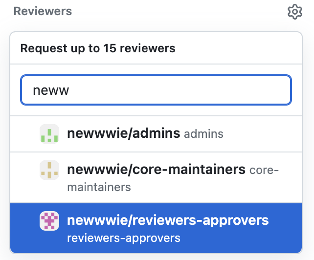

# Contributing to Newwwie Website

This is a community run by the community and even this website is built by the community. 

So if you are reading this... that is YOU! 😊

---

## Setup Dev Environment

### Quickstart

```sh
git clone https://github.com/newwwie/newwwie.com
cd newwwie.com
npm install
npm run dev
```

### Get the project going

```sh
npm install
```

### Run hot reloading development environment

```sh
npm run dev
```

### Build for production

```sh
npm run build
```

---

## Issues, Pull Reqests and Project Planning

### Raise an Issue

If you have a feature request or a bug to report then:

> [Create an issue](https://github.com/newwwie/newwwie.com/issues/new/choose)

### Project Planning

Our team use the below Kanban board to manage work:

[Newwwie.com Website Kanban Board](https://github.com/orgs/newwwie/projects/1)

Someone from the `@newwwie/reviewers-approvers` team will triage the issue and add the appropriate labels to show an issue is good enough for someone to pick up.

### How can I contribute?

You can always pick up an open ticket from the `Ready` column of [Newwwie.com Website Kanban Board](https://github.com/orgs/newwwie/projects/1).

Or you could skip the Create an Issue step and open a [Pull Request](https://github.com/newwwie/newwwie.com/compare).

### Creating a Pull Request

We strongly recommend that when creating a pull request you do the following steps:

1. Fork the repository to your own account
2. Create a new branch
3. Make your changes
4. [Open a pull request across forks](https://docs.github.com/en/pull-requests/collaborating-with-pull-requests/proposing-changes-to-your-work-with-pull-requests/creating-a-pull-request-from-a-fork)
5. Make sure you select `Allow edits by maintainers`

> **!!! IMPORTANT !!!**: Step 2 & 5 above are important, often there are branch protections on `main` branches, when opening a PR please let us have permission to edit your branch as sometimes the feedback given are little tweaks that are easier for us to just ammend and push.

Please set `@newwwie/reviewers-approvers` on the PR to notify the team a PR is open.



## Slack Channel

If you aren't already on Newwwie Slack then [get an invite](https://newwwie.com/#invite).

Then head to the [`#_newwwie_contributors`](https://newwwie.slack.com/archives/C06LRQDN3PD) channel.

We are still working on having hack days where we can meetup in person and hack away at issues.
